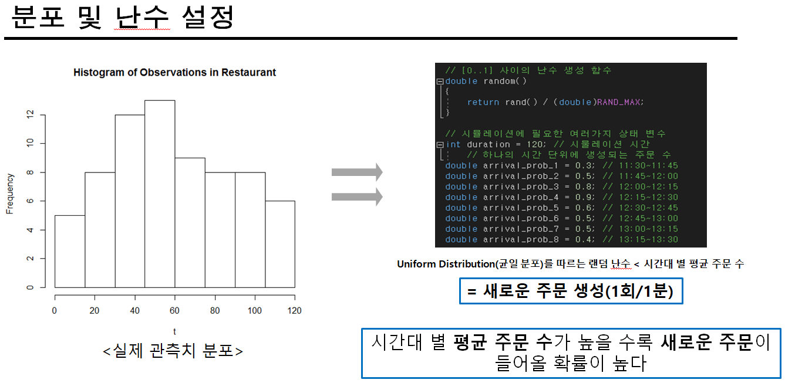
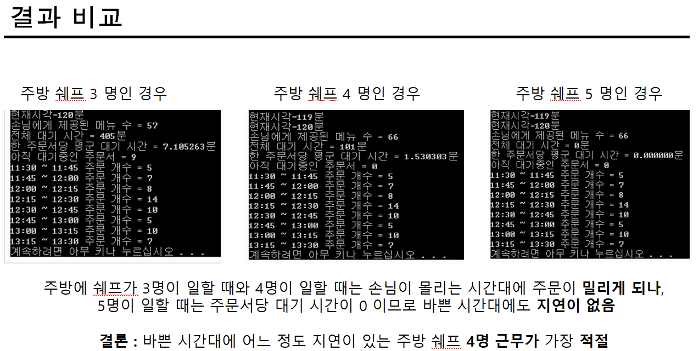

# Monte Carlo Simulation

> model : 알바했었던 파스타 전문점
>
> How : 멀티큐(Multi Queue)를 활용한 대기행렬 구현
>
> Why : 가게의 손님 방문 분포와 조리시간을 고려했을 때 가장 적절한 주방 근무 인원이 몇명인지 파악

### modeling

___

### distribution

___

### Conclusion

___

